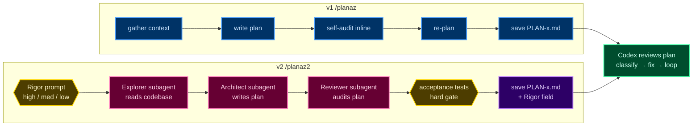
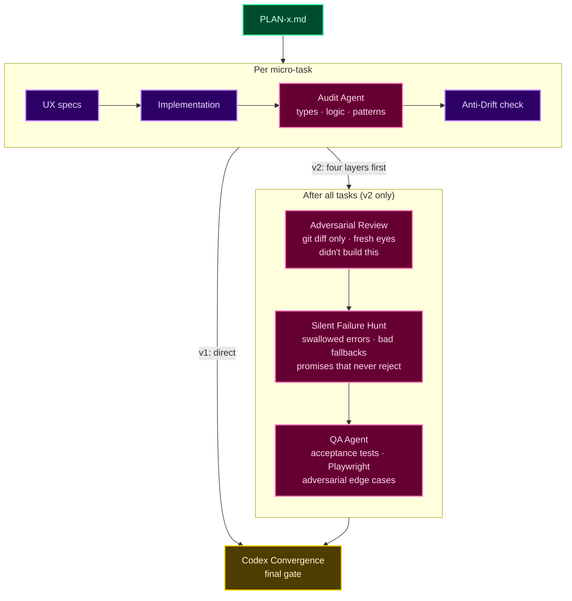
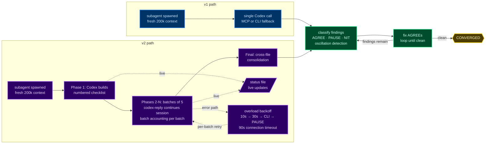
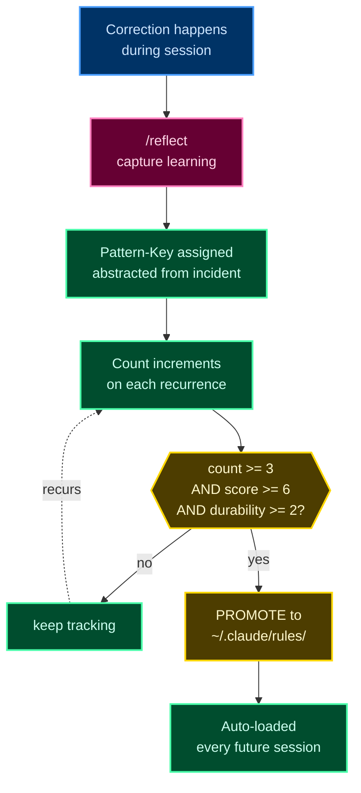

# SMEAC

**S**ituation — Claude writes incomplete, error-prone code unsupervised. It's creative but undisciplined. Codex can't build, but catches what Claude misses.

**M**ission — Make them work together. Claude builds. Codex audits. Disagreements surface to you.

**E**xecution — Structured pipelines for planning (`/planaz`), building (`/build`), and cross-model auditing (`/converge`). Two speeds: v1 (fast) and v2 (thorough).

**A**dmin/Logistics — Session handoff (`/relief`) so context survives. Self-learning (`/reflect`) so mistakes become permanent rules.

**C**ommand/Signal — You approve everything. The system proposes, audits, and flags. You decide.

Built by a Marine who got tired of AI shipping broken code.

---

## How It All Connects

```
                    ┌─────────────────────────────────────┐
                    │          settings.json               │
                    │  (permissions, hooks, plugins,       │
                    │   statusline, effort level)          │
                    └──────────┬──────────────────────────┘
                               │
              ┌────────────────┼────────────────┐
              │                │                │
              ▼                ▼                ▼
     ┌────────────┐   ┌──────────────┐   ┌───────────┐
     │   Hooks    │   │  CLAUDE.md   │   │   Tools   │
     │ (4 scripts)│   │ (rules +     │   │           │
     │            │   │  frameworks) │   │           │
     └────┬───────┘   └──────┬───────┘   └───────────┘
          │                  │
          │    ┌─────────────┼──────────────┐
          │    │             │              │
          ▼    ▼             ▼              ▼
    ┌──────────────┐  ┌───────────┐  ┌──────────────┐
    │   Rules/     │  │ Commands/ │  │   Memory/    │
    │ (promoted    │  │ (slash    │  │ (persistent  │
    │  learnings)  │  │  commands)│  │  knowledge)  │
    └──────────────┘  └───────────┘  └──────────────┘
          ▲                               │
          │    ┌──────────────────────┐    │
          └────│  Self-Learning Loop  │◄───┘
               │  /reflect → score → │
               │  promote → rules/   │
               └──────────────────────┘
```

| Tool | What It Solves |
|------|---------------|
| [**Setup**](setup/) | The foundation — 13 rules, each one a scar from a real incident |
| [**Convergence**](convergence/) | Planning, building, and auditing — v1 (fast) and v2 (thorough) |
| [**Relief**](relief/) | Session handoff — context survives across sessions |
| [**Self-Learning**](self-learning/) | Mistakes get captured, scored, and promoted to permanent rules |

---

## Setup — The Foundation

**Directory:** [`setup/`](setup/)

Example configuration files for Claude Code. These are templates — adapt them to your workflow, don't copy blindly.

| File | What It Does |
|------|-------------|
| `CLAUDE.md.example` | Global instructions — 13 rules governing how Claude works with you |
| `settings.json.example` | Permissions, hook registration, plugins, effort level |
| `statusline.sh` | Context window usage bar (green/yellow/red) + model + git branch |
| `quality-standards.md` | Multi-component work playbook — what "good" looks like |
| `MEMORY-template.md` | Memory index template for persistent cross-session knowledge |
| `learnings-example.md` | Example learning log entry showing the schema |

### The Rules (summarized)

| # | Rule | Why It Exists |
|---|------|--------------|
| 1 | Commit discipline | AI was auto-committing, pushing to main, creating chaos |
| 2 | Explain before acting | AI would write 500 lines before explaining the approach |
| 3 | Fix it right | AI loves quick patches. The right fix prevents rework |
| 4 | Keep it simple | AI defaults to jargon |
| 5 | User makes decisions | AI would assume intent and build the wrong thing |
| 6 | Context survival | AI loses context on long sessions. Task lists are the safety net |
| 7 | Be self-sufficient | AI would punt tasks back: "you'll need to configure X" |
| 8 | No fabrication | AI invents plausible-sounding numbers |
| 9 | Audit = reliability push | Makes `/audit` trigger a Six Sigma-style quality pass |
| 10 | Separate name fields | AI kept creating `full_name` columns |
| 11 | Clean working tree | AI would pile up changes from 3 features in one commit |
| 12 | Investigate before acting | AI would recommend deleting things without checking |
| 13 | Default to subagents | AI tries to do everything in the main thread |

Each rule exists because of a real incident. They're not theoretical best practices — they're scars.

---

## How You Work

This is the full workflow — from idea to shipped code to smarter Claude. Five stages. Everything connects.

### Stage 1: You Have an Idea

Tell Claude what you want to build. If you're still shaping it, a `/designplanbuild` orchestrator can chain the whole sequence — brainstorm, plan, build — with three human checkpoints so you can redirect before code is written. (This is an optional orchestrator you build on top of the shipped commands.) If you already know what you want, go straight to `/planaz` or `/planaz2`. Either way, nothing gets built until there's a plan, and the plan doesn't ship until Codex has reviewed it.

### Stage 2: Plan It

Planning means Claude reads the codebase, writes a micro-tasked plan where every task is atomic (if it has "and" in it, it's two tasks), audits its own plan for missing steps and bad sequencing, revises it, then hands the plan to Codex for an independent review before a single line of code is written.

**v1 `/planaz`** does all of this inline. One Claude instance gathers context, writes the plan, audits it, re-plans, and fires convergence. Fast. Right for low-risk work.

**v2 `/planaz2`** dispatches specialized agents. An explorer subagent reads the codebase. An architect subagent writes the plan — fresh context, no anchoring on what the explorer saw. A reviewer subagent audits it — separate again, didn't write the plan it's critiquing. Hard gate before saving: the plan is rejected without machine-verifiable acceptance tests. Not "the feature works correctly" — it's "POST /api/chat returns 200" or the plan doesn't pass. More methodical at every step.

Both versions end the same way: Codex gets the plan. If it finds design flaws, Claude classifies each finding — agree and fix, pause and ask you, or nit. Loops until clean.



### Stage 3: Build It

Building means Claude executes the plan one micro-task at a time. Every task cycles through four roles — UX specs, implementation, audit, drift check — before the next task starts. No batching. No skipping the loop for "small" changes.

**v1 `/build`** has one AI playing all four Conductor roles inline. It builds, then reconciles honestly — DONE, MISSED, DEVIATED, or FLAGGED for every task. Then runs typecheck, tests, and smoke tests. Fixes findings. Then fires convergence.

**v2 `/build2`** dispatches each Conductor role as a separate subagent with fresh context. By task 15 of a large build, v1's single context is exhausted and starting to hallucinate completions. v2 doesn't have that problem. But the bigger difference is what happens after building. v1 goes straight to convergence. v2 runs four layers of review first.

The layered defense is the most important part of v2:

**Per micro-task:** An Audit Agent reviews types, logic, and patterns before moving to the next task.

**After all tasks complete:**

- **Adversarial Review** — a fresh subagent that only sees the git diff. Didn't build this, has no investment in it, finds things the builder's context glossed over.
- **Silent Failure Hunt** — specifically looks for swallowed errors, bad fallbacks, and promises that never reject. The adversarial reviewer might miss a `catch` block that logs and returns null. This agent hunts for it.
- **QA Agent** — runs every acceptance test from the plan plus adversarial edge cases it generates itself. Playwright, curl, API calls.
- **Codex Convergence** — the final gate. Only after the first three pass does convergence start.



### Under the Hood: Convergence

Convergence is the engine inside the planning and building commands (`/planaz`, `/planaz2`, `/build`, `/build2`) — not a separate thing you invoke directly. You don't call `/converge` by hand during normal workflow. It fires automatically when planning finishes and when building finishes. It's documented here because it needs explanation.

**What convergence does:** Codex reads every file Claude touched. Reports findings with severity. Claude classifies each one — agree (will fix), pause (needs your input), or nit (cosmetic, skip). Fixes the agrees, loops back to Codex. Repeats until clean. If the same finding comes back after a claimed fix, it escalates to you — oscillation detection prevents Claude from spinning forever claiming it fixed something it didn't.

**v1 convergence** is a single Codex call. MCP first, CLI fallback if MCP fails. Simple. Effective for most work.

**v2 convergence** is phased. Codex reads all files and returns a numbered checklist first — that's Phase 1. Then it audits in batches of 5, each batch verified for completeness — Phases 2 through N. Cross-file consolidation at the end catches findings that span multiple files. A live status file at `~/.claude/tmp/convergence-status-<topic>.txt` updates in real time — you can `cat` it from any terminal while it runs. 90-second connection timeout — not response timeout, so once data starts flowing it runs as long as needed. Per-batch escalation: retry, then CLI fallback, then pause to you. No findings ever get dropped silently.

**On rigor:** The Rigor field set at the start of a v2 session controls `model_reasoning_effort` on the convergence pass specifically. The planning and building steps run the same regardless of rigor level. v2 is slower at every step because every phase is more methodical — agent dispatch, adversarial layers, phased batching — not just because of the rigor setting.



### Stage 4: Hand It Off

Context dies. Every session starts from zero — re-discovering decisions, tradeoffs, and edge cases the last session already knew. This is not a Claude problem. It's a sessions problem. The fix is structured handoff.

> *General Order #6: "To receive, obey, and pass on to the sentry who relieves me, all orders from the Commanding Officer, Command Duty Officer, Officer of the Deck, and Officers and Petty Officers of the Watch only."*

`/relief` structures the session's full context as a SMEAC packet — situation, decisions made, work completed, open questions, what comes next — and posts it via the Relief MCP server to local handoff storage. It never includes secrets. Secret values — credentials, API keys, tokens — stay out. Environment variable names are included for operational context, but never their values. The packet preserves the WHY, not just the what.

The next session runs `/assume-watch`, pulls the packet, reads it, and states back what it understands before touching anything. Same project, same context, zero re-discovery. Two guards exchanging watch.

### Stage 5: Get Smarter

Every session, Claude makes mistakes. The same mistakes generic Claude makes every session — forever, unless you build something to stop it. `/reflect` captures corrections, abstracts the pattern, assigns a pattern key, and tracks recurrence. When the same pattern hits count >= 3, total score >= 6, and durability >= 2, it becomes eligible for promotion. Run `/reflect --promote` and the system walks you through each candidate — you approve, edit, or skip before anything becomes a permanent rule at `~/.claude/rules/`. Auto-loaded every future session. Your Claude stops making the mistakes generic Claude makes.

Four hooks run automatically in the background. Session-start surfaces any pattern that keeps recurring, so you know before you start. Stop reminds you to reflect — the system doesn't improve if you skip this step. No-guessing forces investigation before theorizing: Claude can't answer a diagnostic question with "I think" when the code is right there to read. Subagent-stop is a quality gate — it rejects empty or thin results from dispatched agents so the main thread doesn't proceed on garbage.



---

## How to Adopt This

### Prerequisites
- [Claude Code CLI](https://docs.anthropic.com/en/docs/claude-code) installed
- `python3` available (used by hooks)
- `jq` available (used by statusline)
- For convergence: [Codex CLI](https://github.com/openai/codex) installed

### Minimum Viable Setup (start here)
1. Copy `setup/CLAUDE.md.example` to `~/.claude/CLAUDE.md` — edit the rules to match your preferences
2. Copy `setup/settings.json.example` to `~/.claude/settings.json` — adjust permissions
3. `mkdir -p ~/.claude/rules` and copy `self-learning/rules/meta-rules.md` into it
4. Copy `setup/statusline.sh` to `~/.claude/statusline.sh` — context window usage bar

### Add Slash Commands (when ready)
5. `mkdir -p ~/.claude/commands` and copy the shared commands: `convergence/commands/converge.md`, `convergence/commands/audit.md`, `convergence/commands/codex.md`
6. For v1: copy `convergence/commands/planaz.md`, `convergence/commands/build.md`, `convergence/commands/conductor.md`
7. For v2: copy `convergence/commands/planaz2.md`, `convergence/commands/build2.md`, `convergence/commands/conductor2.md`

### Add Session Handoff (when you want context to survive)
8. Install the Relief MCP server — see [`relief/README.md`](relief/README.md) for full setup (`npm install`, `npm run build`, MCP server registration in `settings.json`)
9. Copy `relief/commands/relief.md` and `relief/commands/assume-watch.md` to `~/.claude/commands`

### Add the Self-Learning Loop (when you want it)
10. `mkdir -p ~/.claude/hooks` and copy `self-learning/hooks/*.sh` into it
11. Add the `hooks` section from `setup/settings.json.example` to your settings
12. Create `learnings.md` in your home project memory directory using the schema from `setup/learnings-example.md`
13. Copy the `/reflect` skill from `self-learning/skills/reflect/` to `~/.claude/commands`
14. Use `/reflect` after sessions where Claude made mistakes

### Full System (v1 + v2)
15. Copy everything, personalize the CLAUDE.md rules, and run `convergence/install.sh` — installs v1 (`/planaz`, `/build`, `/conductor`) and v2 (`/planaz2`, `/build2`, `/conductor2`) plus shared commands (`/converge`, `/audit`, `/codex`)

### Key Principle

**Don't copy rules that don't apply to you.** The value is in the system (learning loop, Conductor protocol, convergence loop, hooks) not the specific rules (which are scars from a specific workflow). Your rules will be different — the system helps you discover them.

---

## Philosophy

1. **Mechanical over advisory.** Hooks and gates are enforced. Rules in CLAUDE.md are suggestions. When the problem is mechanical, build infrastructure.
2. **You approve everything.** No auto-commits, no auto-promotions, no auto-anything that changes the system. The human makes decisions.
3. **Infrastructure fails open.** Missing files = exit 0. Hooks stay fast. The tools help when they can and stay out of the way when they can't. (This applies to hooks and infrastructure — application code gets the opposite treatment via the Silent Failure Hunt.)
4. **One-edit reversible.** Every component can be disabled independently. Remove a hook, delete a rule, kill the MCP server — each is a single action.
