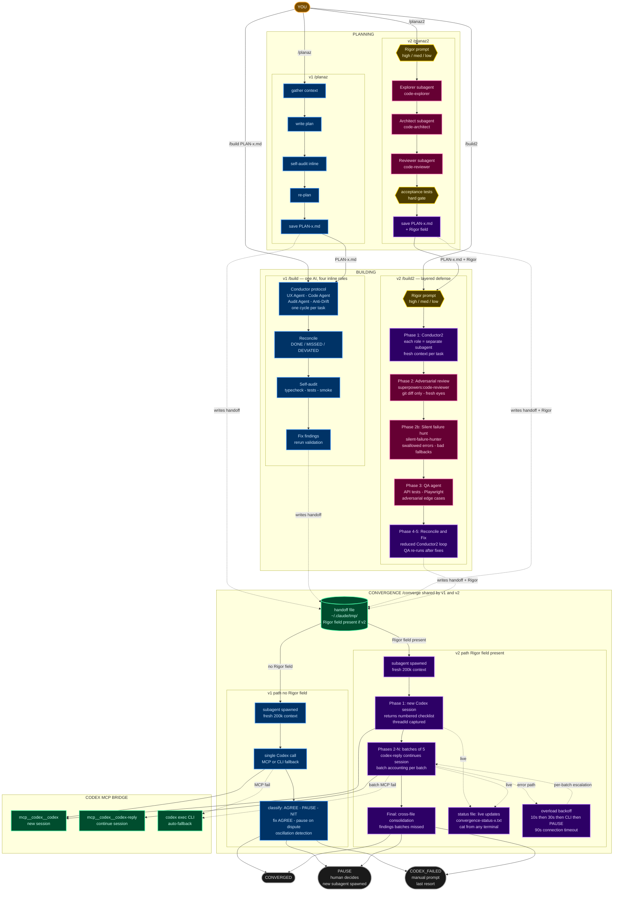

# SMEAC

**Situation. Mission. Execution. Admin/Logistics. Command/Signal.**

A collection of tools that make Claude Code sessions smarter, more durable, and continuously improving. Built by a Marine who got tired of AI amnesia.

---

## How It All Connects

```
                    ┌─────────────────────────────────────┐
                    │          settings.json               │
                    │  (permissions, hooks, plugins,       │
                    │   statusline, effort level)          │
                    └──────────┬──────────────────────────┘
                               │
              ┌────────────────┼────────────────┐
              │                │                │
              ▼                ▼                ▼
     ┌────────────┐   ┌──────────────┐   ┌───────────┐
     │   Hooks    │   │  CLAUDE.md   │   │   Tools   │
     │ (4 scripts)│   │ (rules +     │   │           │
     │            │   │  frameworks) │   │           │
     └────┬───────┘   └──────┬───────┘   └───────────┘
          │                  │
          │    ┌─────────────┼──────────────┐
          │    │             │              │
          ▼    ▼             ▼              ▼
    ┌──────────────┐  ┌───────────┐  ┌──────────────┐
    │   Rules/     │  │ Commands/ │  │   Memory/    │
    │ (promoted    │  │ (slash    │  │ (persistent  │
    │  learnings)  │  │  commands)│  │  knowledge)  │
    └──────────────┘  └───────────┘  └──────────────┘
          ▲                               │
          │    ┌──────────────────────┐    │
          └────│  Self-Learning Loop  │◄───┘
               │  /reflect → score → │
               │  promote → rules/   │
               └──────────────────────┘
```

Each tool solves a specific failure mode:

| Tool | Problem It Solves | Status |
|------|------------------|--------|
| [**Setup**](setup/) | Starting from scratch with no discipline | Example configs |
| [**Convergence**](convergence/) | AI writes code nobody audits. Bugs ship. v1 (fast) + v2 (thorough). | Deployed |
| [**Relief**](relief/) | Sessions degrade. Context dies. Next session starts from zero. | Built |
| [**Self-Learning**](self-learning/) | Same mistakes repeat across sessions. No institutional memory. | WIP |

---

## Setup — The Foundation

**Directory:** [`setup/`](setup/)

Example configuration files for Claude Code. These are templates — adapt them to your workflow, don't copy blindly.

| File | What It Does |
|------|-------------|
| `CLAUDE.md.example` | Global instructions — 13 rules governing how Claude works with you |
| `settings.json.example` | Permissions, hook registration, plugins, effort level |
| `statusline.sh` | Context window usage bar (green/yellow/red) + model + git branch |
| `quality-standards.md` | Multi-component work playbook — what "good" looks like |
| `MEMORY-template.md` | Memory index template for persistent cross-session knowledge |
| `learnings-example.md` | Example learning log entry showing the schema |

### The Rules (summarized)

| # | Rule | Why It Exists |
|---|------|--------------|
| 1 | Commit discipline | AI was auto-committing, pushing to main, creating chaos |
| 2 | Explain before acting | AI would write 500 lines before explaining the approach |
| 3 | Fix it right | AI loves quick patches. The right fix prevents rework |
| 4 | Keep it simple | AI defaults to jargon |
| 5 | User makes decisions | AI would assume intent and build the wrong thing |
| 6 | Context survival | AI loses context on long sessions. Task lists are the safety net |
| 7 | Be self-sufficient | AI would punt tasks back: "you'll need to configure X" |
| 8 | No fabrication | AI invents plausible-sounding numbers |
| 9 | Audit = reliability push | Makes `/audit` trigger a Six Sigma-style quality pass |
| 10 | Separate name fields | AI kept creating `full_name` columns |
| 11 | Clean working tree | AI would pile up changes from 3 features in one commit |
| 12 | Investigate before acting | AI would recommend deleting things without checking |
| 13 | Default to subagents | AI tries to do everything in the main thread |

Each rule exists because of a real incident. They're not theoretical best practices — they're scars.

---

## Convergence — Cross-Model Verification

**Directory:** [`convergence/`](convergence/)

Two AI systems checking each other's work. Claude Code builds, Codex CLI reviews. Disagreements surface to you. Everything else runs automatically.

Two versions: **v1 is fast** (minutes for small plans). **v2 is thorough** (dispatches specialized agents, runs adversarial review, hunts silent failures, phased Codex auditing). Pick based on what a missed bug costs.

### v1 vs v2 — All Commands

| | v1 (fast) | v2 (thorough) | Shared |
|---|---|---|---|
| **Plan** | `/planaz` — inline | `/planaz2` — agent-dispatched, acceptance tests required | |
| **Build** | `/build` — 4 inline roles | `/build2` — subagent roles + adversarial review + QA | |
| **Micro-task** | `/conductor` — 1 AI, 4 perspectives | `/conductor2` — each role = separate subagent | |
| **Converge** | | | `/converge` — v2 mode when Rigor field present |
| **Audit** | `/audit` — reliability push | | Used by both versions |
| **Codex** | `/codex` — manual prompt | | Fallback for both |

### System Map



**Legend:** Blue = v1 (fast, inline). Purple = v2 (thorough, subagents). Pink = dispatched agent. Green = shared infrastructure. Gold = quality gates. Dashed lines = fallback/error paths.

**[Full documentation →](convergence/CONVERGENCE.md)**

---

## Relief — Session Handoff

**Directory:** [`relief/`](relief/)

> *General Order #6: "To receive, obey, and pass on to the sentry who relieves me, all orders from the Commanding Officer, Command Duty Officer, Officer of the Deck, and Officers and Petty Officers of the Watch only."*

An MCP server that lets Claude Code sessions hand off context to each other — like two guards exchanging watch. One session posts relief (pushes its full context as a SMEAC order), the next session assumes the watch (pulls it and continues).

| Tool | Marine Equivalent | What It Does |
|------|------------------|-------------|
| `post_relief` | "I stand relieved" | Push current session context to the broker |
| `assume_watch` | "I have the watch" | Pull the latest handoff for this working directory |
| `check_questions` | Radio check | Read/post questions between sessions |

**Status: Built** — see [relief/README.md](relief/) for installation and usage.

---

## Self-Learning — Institutional Memory

**Directory:** [`self-learning/`](self-learning/)

A reflection and recurrence-tracking system that turns session corrections into permanent rules.

```
Correction happens  →  /reflect captures it  →  Pattern-Key assigned
                                                       │
                                                 Count increments
                                                 on recurrence
                                                       │
                                            Count >= 3, Score >= 6?
                                                  /          \
                                                no           yes
                                                │             │
                                          keep tracking    PROMOTE to
                                                          ~/.claude/rules/
```

### Components

| Component | Type | Purpose |
|-----------|------|---------|
| `/reflect` | Skill | Capture learnings, count recurrence, promote to rules |
| `session-start.sh` | Hook | MCP health check + surface recurring patterns |
| `stop-reflect.sh` | Hook | Remind to capture learnings at session end |
| `no-guessing.sh` | Hook | Force investigation before answering diagnostic questions |
| `subagent-stop.sh` | Hook | Quality gate — reject empty/thin agent results |
| `meta-rules.md` | Rule | How to write rules — keeps promoted rules concise |

**Status: WIP** — deployed and running. See [self-learning/](self-learning/) for details.

---

## How to Adopt This

### Prerequisites
- [Claude Code CLI](https://docs.anthropic.com/en/docs/claude-code) installed
- `python3` available (used by hooks)
- `jq` available (used by statusline)
- For convergence: [Codex CLI](https://github.com/openai/codex) installed

### Minimum Viable Setup (start here)
1. Copy `setup/CLAUDE.md.example` to `~/.claude/CLAUDE.md` — edit the rules to match your preferences
2. Copy `setup/settings.json.example` to `~/.claude/settings.json` — adjust permissions
3. `mkdir -p ~/.claude/rules` and copy `self-learning/rules/meta-rules.md` into it
4. Copy `setup/statusline.sh` to `~/.claude/statusline.sh` — context window usage bar

### Add Slash Commands (when ready)
5. `mkdir -p ~/.claude/commands` and copy `convergence/commands/audit.md` into it
6. Copy `convergence/commands/conductor.md` to `~/.claude/commands/conductor.md`

### Add the Self-Learning Loop (when you want it)
7. `mkdir -p ~/.claude/hooks` and copy `self-learning/hooks/*.sh` into it
8. Add the `hooks` section from `setup/settings.json.example` to your settings
9. Create `learnings.md` in your home project memory directory using the schema from `setup/learnings-example.md`
10. Use `/reflect` after sessions where Claude made mistakes

### Full System (v1 + v2)
11. Copy everything, personalize the CLAUDE.md rules, and run `convergence/install.sh` — installs both v1 and v2 commands

### Key Principle

**Don't copy rules that don't apply to you.** The value is in the system (learning loop, Conductor protocol, convergence loop, hooks) not the specific rules (which are scars from a specific workflow). Your rules will be different — the system helps you discover them.

---

## Philosophy

1. **Mechanical over advisory.** Hooks and gates are enforced. Rules in CLAUDE.md are suggestions. When the problem is mechanical, build infrastructure.
2. **You approve everything.** No auto-commits, no auto-promotions, no auto-anything that changes the system. The human makes decisions.
3. **Fail silently, not loudly.** Missing files = exit 0. Hooks stay fast (the MCP health check has a 5-second timeout per server as the upper bound). The tools help when they can and stay out of the way when they can't.
4. **One-edit reversible.** Every component can be disabled independently. Remove a hook, delete a rule, kill the MCP server — each is a single action.
