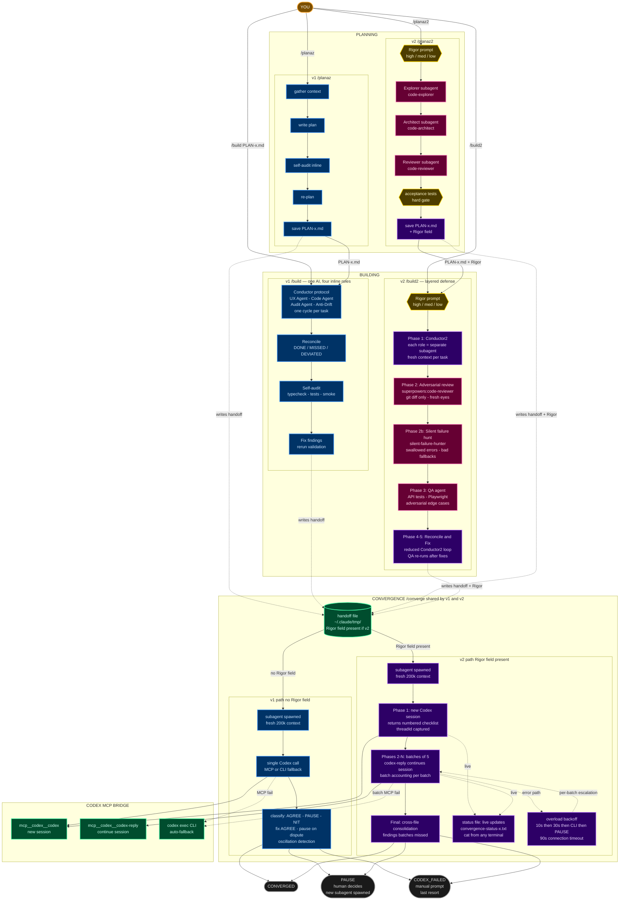

# Convergence — System Reference

Two AI systems checking each other's work. Claude Code builds, Codex CLI reviews. Disagreements surface to you. Everything else runs automatically.

This document explains the full system — how the commands work, how they connect, what the file formats are, and how to troubleshoot. Read it top to bottom if you're new. Reference specific sections later.

---

## v1 vs v2 — Pick Your Speed

Both versions produce Codex-audited, converged output. The difference is how much scrutiny happens before that final gate.

| | v1 (`/planaz`, `/build`) | v2 (`/planaz2`, `/build2`) |
|---|---|---|
| **Planning** | Claude plans + self-audits inline | Dispatches specialized agents: explorer → architect → reviewer. Each role is a separate subagent with fresh context. |
| **Build execution** | Conductor protocol (4 roles, 1 AI) | Conductor2 protocol (4 roles dispatched as separate subagents) + adversarial review + silent failure hunt + QA agent |
| **Acceptance tests** | Not required | Hard gate — plan rejected without machine-verifiable acceptance tests |
| **Convergence** | Single monolithic Codex call | Phased auditing: Codex builds a checklist → audits in batches of 5 → consolidates cross-file findings. Per-batch retry/CLI/PAUSE escalation. |
| **Rigor control** | None — fixed behavior | Rigor prompt before any work: `high` (six sigma), `medium` (default), `low` (fast pass) |
| **Observability** | None during convergence | Live status file: `cat ~/.claude/tmp/convergence-status-<topic>.txt` |
| **Error handling** | MCP fail → CLI fallback → CODEX_FAILED | 90s connection timeout, overload backoff (10s→30s→CLI→PAUSE), thread staleness probes, batch accounting, auth error detection |
| **Speed** | Faster. Minutes for small plans. | Slower. The agent dispatch, adversarial review, and phased auditing add time. |
| **When to use** | Quick features, config changes, formatting fixes, anything where speed matters more than depth | Production deploys, auth systems, billing logic, data migrations, anything where a missed bug is expensive |

**v1 is not deprecated.** It's the right tool when the cost of a bug is low and the cost of waiting is high. v2 is for when you'd rather wait an extra 20 minutes than ship a subtle race condition.

Both versions share the same `/converge` loop — v2 just upgraded it with phased auditing and observability. v1 callers still work (the loop defaults to medium rigor and single-call Codex when the handoff doesn't include v2 fields).

### System Map

The build system has two versions that share a common convergence layer. V1 is fast and inline — one AI plays all four conductor roles sequentially. V2 dispatches each role as a separate subagent with fresh context, adds three layers of adversarial review before convergence, and upgrades the convergence loop with phased Codex auditing, a live status file, and per-batch failure escalation. The handoff file's `Rigor` field is what switches the loop into v2 mode.



**Legend:** Blue = v1 (fast, inline). Purple = v2 (thorough, subagents). Pink = dispatched agent. Green = shared infrastructure. Gold = quality gates. Dashed lines = fallback/error paths.

---

## How the Pieces Fit Together

### v1 — Six slash commands, one MCP bridge, two ephemeral file types.

```
YOU
 |
 |  /planaz "build user auth"        /build PLAN-user-auth.md
 |          |                                  |
 v          v                                  v
 ┌──────────────────┐              ┌──────────────────┐
 │  Steps 1-5       │              │  Phases 1-4      │
 │  Plan the work   │              │  Build the work  │
 │  (uses /audit    │              │  (uses /conductor│
 │   internally)    │              │   and /audit)    │
 └────────┬─────────┘              └────────┬─────────┘
          |                                  |
          |  writes handoff file             |  writes handoff file
          |  to ~/.claude/tmp/               |  to ~/.claude/tmp/
          v                                  v
 ┌──────────────────────────────────────────────┐
 │  SUBAGENT (fresh 200k context)               │
 │  runs /converge                              │
 │                                              │
 │  reads handoff → calls Codex MCP → classifies│
 │  findings → fixes AGREE → pauses for you on  │
 │  disputes → iterates until clean             │
 └──────────────────┬───────────────────────────┘
                    |
          returns CONVERGED / PAUSE / CODEX_FAILED
                    |
                    v
          You see the report.
          If PAUSE: you decide, loop continues.
          If CONVERGED: done.
          If CODEX_FAILED: both MCP and CLI failed — manual prompt (last resort).
```

### v1 command dependency chain

| Command | Uses internally | Used by |
|---------|----------------|---------|
| `/planaz` | `/audit` (self-audit), `/converge` (via subagent) | You |
| `/build` | `/conductor` (micro-tasking), `/audit` (self-audit), `/converge` (via subagent) | You |
| `/converge` | Codex MCP tool | `/planaz`, `/build`, or you directly |
| `/conductor` | Nothing | `/build` |
| `/audit` | Nothing | `/planaz`, `/build`, or you directly |
| `/codex` | Nothing | You (manual fallback) |

### v2 — Specialized agents, layered defense, phased auditing.

```
YOU
 |
 |  /planaz2 "build user auth"        /build2
 |   (rigor prompt first)              (rigor prompt first)
 v          |                                  |
 ┌──────────┴──────────┐              ┌────────┴──────────────────┐
 │  Dispatched agents: │              │  Phase 1: Build           │
 │  Explorer → Architect│             │   (Conductor2 — agents)   │
 │   → Reviewer        │              │  Phase 2: Adversarial     │
 │  Hard gate:         │              │   review (fresh eyes)     │
 │   acceptance tests  │              │  Phase 2b: Silent failure │
 │   required          │              │   hunt                    │
 └────────┬────────────┘              │  Phase 3: QA agent        │
          |                           │  Phase 4: Reconciliation  │
          |  writes handoff           │  Phase 5: Fix findings    │
          |  (includes Rigor level)   └────────┬──────────────────┘
          v                                    v
 ┌──────────────────────────────────────────────┐
 │  SUBAGENT runs /converge (v2 mode)           │
 │                                              │
 │  Phase 1: Codex reads files, returns checklist│
 │  Phase 2-N: Audits in batches of 5           │
 │  Final: Cross-file consolidation             │
 │                                              │
 │  Status file updated at every step           │
 │  90s connection timeout per call             │
 │  Overload backoff: 10s → 30s → CLI → PAUSE  │
 │  Per-batch: retry → CLI → PAUSE (no drops)   │
 └──────────────────┬───────────────────────────┘
                    |
          returns CONVERGED / PAUSE / CODEX_FAILED
```

### v2 command dependency chain

| Command | Uses internally | Used by |
|---------|----------------|---------|
| `/planaz2` | `feature-dev:code-explorer`, `feature-dev:code-architect`, `feature-dev:code-reviewer` (subagents), `/converge` (via subagent) | You |
| `/build2` | `feature-dev:code-architect`, `feature-dev:code-reviewer`, `superpowers:code-reviewer`, `pr-review-toolkit:silent-failure-hunter` (subagents), `/converge` (via subagent) | You |
| `/converge` | Codex MCP (`mcp__codex__codex`, `mcp__codex__codex-reply`), Codex CLI fallback | `/planaz2`, `/build2`, `/planaz`, `/build`, or you directly |
| `/conductor2` | Nothing | `/build2` |

---

## v1 Commands

## /planaz — Plan A-to-Z

**What:** Full planning pipeline. Takes an objective, produces an audited, Codex-reviewed plan.

**When to use:** Before writing any code. When you need a structured plan for a feature, refactor, or system change.

**Syntax:** `/planaz Build user authentication with OAuth2 and JWT tokens`

### Steps

1. **Gather Context** — Read CLAUDE.md, roadmap, git status, all relevant files. Understand the project before planning.
2. **Plan** — Create a Conductor plan: objective, scope, numbered micro-tasks (atomic — if it has "and" it's two tasks), success criteria, dependencies, affected files, risk areas.
3. **Self-Audit** — Audit the plan like a code review. Check: is each task atomic? Dependencies correct? Missing migrations/tests/env vars? Scope creep? Produce findings with severity (BLOCKER/WARNING/NIT).
4. **Re-Plan** — Incorporate all self-audit findings. The revised plan is tighter and more complete.
5. **Save** — Write `PLAN-<topic>.md` to the project root. Includes the plan, audit findings that shaped it, and context gathered.
6. **Convergence Loop** — Write handoff file, spawn subagent, subagent runs `/converge`. Codex audits the plan. Claude classifies findings, fixes AGREE items, pauses for you on disputes. Iterates until convergence.
7. **Report + Cleanup** — Present convergence report. Delete ephemeral files.

**Never:** writes code, commits anything, executes the plan.

**Output:** `PLAN-<topic>.md` file ready for `/build`.

---

## /build — Execute a Plan

**What:** Executes a plan micro-task by micro-task with continuous quality checks at every step.

**When to use:** After `/planaz` produces a plan file, or when you have a plan from any source.

**Syntax:** `/build PLAN-user-authentication.md`

### Phases

1. **Build** — Execute tasks one at a time using the Conductor protocol. Each task cycles through: define scope → check UX constraints → implement → audit the change → confirm no drift. Mid-build reconciliation after every task.
2. **Reconcile** — Go through every task in the plan. Report status: DONE / MISSED / DEVIATED / FLAGGED. Honest — doesn't round up to green.
3. **Self-Audit** — Run typecheck, tests, build verification, API smoke tests. Report hard metrics (pass/fail counts), not opinions.
4. **Fix** — Fix every finding from the self-audit using Conductor protocol. Rerun validation. Report updated counts.
5. **Convergence Loop** — Capture git diff (cap 500 lines). Write handoff file with build context (diff, self-audit findings, reconciliation). Spawn subagent running `/converge`. Codex reviews the code + change history. Claude classifies, fixes, pauses. Iterates.
6. **Report + Cleanup** — Present build reconciliation + convergence results + test counts. Delete ephemeral files.

**Never:** commits anything. Waits for you to say "commit."

**After subagent returns:** Main session runs `git status` + validation to verify the subagent's changes are correct.

---

## /converge — The Convergence Loop

**What:** The standalone convergence loop. Reads a handoff file, calls Codex via MCP, classifies findings, fixes or pauses, iterates until clean.

**When to use:** Called automatically by `/planaz` and `/build`. Can also be run manually in a fresh session.

**Syntax:** `/converge ~/.claude/tmp/convergence-handoff-auth.md`

### The loop (steps A through H)

**A. Build Codex prompt** — Reconstruct from handoff file. Self-contained. Each iteration rebuilds from current state (no accumulation). For plans: include plan file, project context, decisions. For builds: include git diff + self-audit findings.

**B. Invoke Codex** — Call the `codex` MCP tool. If MCP fails, fall back to `codex exec` CLI. Codex reads files, can run tests, reports findings. If both MCP and CLI fail → return CODEX_FAILED with manual prompt. **Always decline if Codex asks to write/edit files.** Codex audits. Claude fixes.

**C. Classify findings** — For each finding:
- **AGREE** — Real issue. Will fix automatically.
- **PAUSE** — Needs human input. Use when: Claude disagrees (with reasoning), is uncertain, fix would expand scope, requires a product decision, or multiple valid approaches exist.
- **NIT** — Cosmetic. Log it, don't fix.

Every classification must include specific reasoning referencing the actual code or plan. "I don't think this is an issue" is not sufficient.

**D. Check for PAUSE** — If any PAUSE findings: stop the loop, write state to iteration log, return PAUSE to the parent session with the findings summary. Parent presents to user, gets decision, re-spawns subagent with the decision.

**E. Check oscillation** — Read iteration log. If the same finding (same file + same issue type) appeared in the previous iteration after a claimed fix, escalate to PAUSE. Don't fix the same thing twice without human input.

**F. Apply fixes** — For plans: revise the plan file. For builds: apply code fixes using Conductor protocol, rerun validation.

**G. Log the iteration** — Append to `~/.claude/tmp/convergence-log-<topic>.md`. Compaction rule: full detail for the last iteration, one-line summaries for earlier ones.

**H. Check convergence** — Zero AGREE findings = converged → return CONVERGED with report. Otherwise: check for checkpoint (plans every 3 iterations, builds every 5) → ask user to continue or stop. Then loop back to A.

### Return types

| Return | Meaning | Parent session behavior |
|--------|---------|------------------------|
| CONVERGED | Codex has nothing left to flag | Present report, cleanup |
| PAUSE | Human input needed | Present findings, get decision, re-spawn |
| CODEX_FAILED | Both MCP and CLI failed | Present manual prompt (last resort) |
| HANDOFF_INVALID | Handoff file missing required sections | Rewrite handoff, retry once |

### Parent-session failures (not subagent returns)

| Failure | Behavior |
|---------|----------|
| Subagent won't spawn | Suggest running `/converge` manually in a fresh session |
| Subagent timeout | Retry once, then present error |

---

## /conductor — Micro-Tasking Framework

**What:** Decomposes work into atomic sequential tasks. Each task cycles through four agent roles.

**When to use:** Used internally by `/build`. Can also be invoked directly for any multi-step task.

**Core rule:** If a task has "and" in it, it's two tasks. One task per cycle, full loop every time. No skipping "for small changes."

### The four roles (one AI, four perspectives)

| Role | Does | Does NOT |
|------|------|----------|
| **UX Agent** | Ensures change matches existing patterns/conventions. Provides specs before code. | Write code |
| **Code Agent** | Implements exactly one task, following UX specs and the plan. | Self-review |
| **Audit Agent** | Line-by-line review. Findings are specific: file, line, problem, expected vs actual. | Fix issues |
| **Anti-Drift Agent** | Enforces scope. Restates task at start, confirms completion at end. Veto authority. | Implement or review |

### The loop

1. Conductor defines the next task
2. Anti-Drift restates scope, confirms prior task closed
3. UX provides specs for this task only
4. Code implements this task only
5. Audit reviews, produces findings
6. Conductor routes findings (fix) or marks complete
7. Anti-Drift confirms no drift, next cycle

Issues found → repeat from 3 or 4. Clean → next task.

---

## /audit — Reliability Push

**What:** Proactively finds failures, adds tests, runs validation, fixes root causes until stable.

**When to use:** Used internally by `/planaz` (self-audit the plan) and `/build` (Phase 3). Can be run independently on any feature.

### What it does

1. Re-read project CLAUDE.md and existing test infrastructure
2. Proactively find failures — don't wait to be told where to look
3. Add tests if missing — match existing project patterns
4. Run high-volume validation, report hard metrics
5. Fix root causes (not symptoms), rerun until stable

### What it reports

- Pass/fail counts, not opinions
- Exact commands run
- What changed and why
- Residual risk (honest assessment of what could still break)

---

## /codex — Manual Prompt Generator

**What:** Generates a copy-paste Codex audit prompt based on the current session's work.

**When to use:** When you want to run Codex manually (the pre-automation workflow). Also used as the fallback when MCP fails.

**Syntax:** `/codex` (no arguments — uses the current session's context)

**Output:** A fenced code block containing a self-contained Codex prompt with: what was done, project root, key files, CLAUDE.md path, tech stack, and audit instructions.

---

## v2 Commands

## /planaz2 — Plan A-to-Z v2

**What:** Full planning pipeline with specialized subagents and mandatory acceptance tests. More thorough than `/planaz` — every role (explorer, architect, reviewer) runs as an independent agent with fresh context.

**When to use:** Production features, auth systems, billing, data migrations, anything where a missed edge case costs real money or real time.

**Syntax:** `/planaz2 Build phased Codex auditing with session persistence`

### What's different from v1

1. **Rigor prompt** — First question before any work: `high` / `medium` / `low`. Sets the Codex inference depth for the convergence loop. You answer before walking away.
2. **Dispatched agents** — Context gathering, plan writing, and plan auditing each run as separate subagents (`feature-dev:code-explorer`, `feature-dev:code-architect`, `feature-dev:code-reviewer`). Fresh context, no cross-contamination.
3. **Acceptance tests hard gate** — Plan is rejected without machine-verifiable acceptance tests. Three required sections: API tests, browser tests, unit tests. Types that don't apply are marked N/A, but the sections must exist.
4. **Testability gate** — "Works correctly" is not a success criterion. Every criterion must be verifiable by curl, a test runner, or Playwright.

### Steps

1. **Gather Context** — Dispatch `feature-dev:code-explorer`. Returns structured context summary.
2. **Plan** — Dispatch `feature-dev:code-architect`. Produces Conductor2 plan with acceptance tests.
3. **Audit** — Dispatch `feature-dev:code-reviewer`. Checks atomicity, sequencing, missing tasks, testability.
4. **Re-Plan** — Re-dispatch architect with audit findings.
5. **Save** — Write `PLAN-<topic>.md` with plan + audit findings + context.
6. **Convergence** — Write handoff (includes Rigor field), spawn `/converge` subagent.
7. **Report + Cleanup** — Present report, delete temp files.

---

## /build2 — Execute a Plan v2

**What:** Executes a plan with layered defense — specialized agents for every role, adversarial review by a fresh reviewer, silent failure hunting, and a dedicated QA agent. Slower than `/build`, catches more.

**When to use:** After `/planaz2` produces a plan. Or any plan where you want maximum scrutiny before shipping.

### What's different from v1

1. **Rigor prompt** — Same as `/planaz2`. First question, before any code.
2. **Conductor2 protocol** — Build agents dispatched as subagents, not inline roles.
3. **Adversarial review (Phase 2)** — A fresh `superpowers:code-reviewer` that receives ONLY the git diff, plan, and CLAUDE.md. It didn't build this. That's the point.
4. **Silent failure hunt (Phase 2b)** — `pr-review-toolkit:silent-failure-hunter` checks for swallowed errors, bad fallbacks, missing error propagation.
5. **QA agent (Phase 3)** — Runs acceptance tests from the plan against a live instance. API tests via curl, browser tests via Playwright, adversarial edge cases it generates itself.
6. **Fix loop (Phase 5)** — All findings from Phases 2, 2b, 3 fixed via reduced Conductor2 loop. QA re-runs after fixes.

### Phases

1. **Build** — Conductor2 protocol, micro-task by micro-task, mid-build reconciliation.
2. **Adversarial Review** — Independent reviewer, fresh context, git diff only.
2b. **Silent Failure Hunt** — Error handling audit.
3. **QA** — API tests, browser tests, adversarial edge cases, unit tests.
4. **Reconciliation** — Every task: DONE / MISSED / DEVIATED / FLAGGED.
5. **Fix Findings** — Reduced Conductor2 loop for all review/QA findings.
6. **Convergence** — Handoff with Rigor field, phased Codex audit.
7. **Final Report** — What changed, QA results, adversarial findings, convergence results, residual risk.

### The layered defense model

```
Per micro-task:
  Audit Agent ─── code-level: types, logic, patterns

End of build:
  Adversarial ─── integration-level: design flaws, missed connections
  Silent Hunt ─── error handling: swallowed errors, bad fallbacks
  QA Agent ───── feature-level: broken flows, edge cases, real requests
  Codex ──────── architectural-level: things everyone is too close to see
```

---

## /conductor2 — Micro-Tasking v2

**What:** Same four-role framework as `/conductor`, but each role dispatches to a specialized subagent instead of running inline.

**Why subagents matter:** In v1, all four roles share one context window. By task 15 of a big build, the Audit Agent is working with the dregs of context. In v2, each role gets fresh context every cycle.

### Dispatch table

| Role | Agent Type | What It Does |
|------|-----------|------------|
| UX Agent | `feature-dev:code-explorer` | Provides specs and constraints for this task |
| Code Agent | `feature-dev:code-architect` | Implements this task only |
| Audit Agent | `feature-dev:code-reviewer` | Reviews, produces findings |
| Anti-Drift | Conductor (inline) | Enforces scope — this one stays in the main context |

### The iron law

The conductor dispatches agents. The conductor does NOT implement, review, or provide specs itself. If a subagent returns thin results, re-dispatch with a better prompt. If it fails twice, flag to the user. Never absorb the work into the conductor's context.

---

## /converge — The Convergence Loop (v2 upgrades)

The `/converge` command is shared between v1 and v2. When called by v2 commands (which include a `Rigor` field in the handoff), it enables phased auditing. When called by v1 commands (no Rigor field), it defaults to medium rigor and the v1 single-call behavior still works as a fallback.

### What v2 adds to the loop

**Rigor control** — Read from handoff. Maps to Codex's `model_reasoning_effort` config: `low`, `medium`, `high`. Default: medium (backward-compatible with v1 callers). Shown in the convergence report.

**Phased auditing (Step B):**
- **Phase 1:** `mcp__codex__codex` starts a new session. Codex reads all files, returns a numbered audit checklist. `threadId` captured for session persistence.
- **Phases 2-N:** `mcp__codex__codex-reply` continues the session. Audits in batches of 5 items. Each batch verified for completeness (batch accounting).
- **Final Phase:** Consolidation — cross-file findings that individual batches missed.

**Connection timeout (90s)** — If an MCP call returns zero data in 90 seconds, it's considered hung. This is NOT a response timeout — once data flows, the call runs as long as needed. Timeout and overload have separate handling paths.

**Overload backoff** — Explicit 429/503 errors trigger: wait 10s → retry → wait 30s → retry → CLI → PAUSE. Applies at all phases.

**Per-batch failure escalation** — No findings are ever dropped. Retry on same thread → CLI for that batch → PAUSE to user. Only two options on PAUSE: retry or manual audit. No "continue without."

**Thread staleness probe** — After any batch falls back to CLI, probe the MCP session before the next batch. If stale, abandon MCP and CLI the rest.

**Status file** — `~/.claude/tmp/convergence-status-<topic>.txt`. JSON single line, overwritten at every step transition. `cat` it from any terminal to see where the loop is. Deleted on every return (CONVERGED, PAUSE, CODEX_FAILED).

**Auth error detection** — If both MCP and CLI fail with the same authentication/permission error, bypass retry and go straight to CODEX_FAILED. Repeated auth failures are configuration problems, not transient issues.

---

## File Formats

### Handoff file

Written by `/planaz` or `/build` at `~/.claude/tmp/convergence-handoff-<topic>.md`.

Data only — no instructions. `/converge` reads this to reconstruct the Codex audit prompt.

```markdown
## Audit Target
- Type: plan | build
- Objective: [one sentence]
- Plan file: [absolute path]
- Project root: [absolute path]

## Project Context
- Project instructions: [path to CLAUDE.md and/or AGENTS.md]
- Roadmap: [path or "none"]
- Tech stack: [one-liner]
- Key decisions:
  - [decision 1]
  - [decision 2]
- Rigor: [high | medium | low — v2 only, absent in v1 handoffs]

## Files to Audit
- [absolute path]
- [absolute path]
- ...

## Validation Context
- Commands run: [list of commands + results]
- Pass/fail: [counts]
- Diff type: full | summary
- Residual risk from self-audit: [if any]

## Change Context (build only)
- Git diff or file summary: [capped 500 lines or file list with line counts]
- Self-audit findings: [what was found and fixed]
- Build reconciliation: [flags, deviations]

## Resume State (only after PAUSE)
- Continue from iteration: [N]
- User's decision: [what was decided]
- Prior iteration summary: [one-line per prior iteration]
```

### Iteration log

Written by `/converge` at `~/.claude/tmp/convergence-log-<topic>.md`.

Append-only. Used for oscillation detection.

```markdown
## Iteration 1
### Codex Findings
- [Finding] → AGREE — [reasoning]
- [Finding] → PAUSE — [reasoning]
### Fixes Applied
- [what changed and why]
### Tests Rerun (build only)
- [command]: [pass/fail]
### Paused Items
- [what was escalated]

## Iteration 2 (compacted from iteration 1)
- Iter 1: 3 findings, 2 fixed, 1 paused (user said skip)
### Codex Findings
- [Finding] → AGREE — [reasoning]
...
```

**Compaction rule:** When writing iteration N, compact iterations 1 through N-2 into one-line summaries. Keep N-1 in full detail (needed for oscillation detection).

### Both files are ephemeral

Created during the loop, deleted when it completes (converged, aborted, or errored). They live in `~/.claude/tmp/` — never in the project directory, never in git.

---

## MCP Bridge

Codex CLI has a built-in MCP server. The installer registers it in `~/.mcp.json`:

```json
{
  "mcpServers": {
    "codex": {
      "command": "codex",
      "args": ["--dangerously-bypass-approvals-and-sandbox", "mcp-server"]
    }
  }
}
```

**Important: flag ordering.** The `--dangerously-bypass-approvals-and-sandbox` flag (and `-a` / `-s` flags) are top-level `codex` flags, not `mcp-server` subcommand flags. They must come **before** `mcp-server` in the args array. Putting them after will silently fail with `unexpected argument`.

This gives Claude Code two MCP tools:
- **`codex`** — Start a new Codex conversation (accepts prompt, cwd, config)
- **`codex-reply`** — Continue an existing Codex conversation

The bypass flag means Codex runs with zero permission prompts. It can read files, run tests, execute scripts freely. **But Claude always declines if Codex asks to write or edit files.** Codex is the auditor. Claude applies fixes.

### Requires restart

Changes to `~/.mcp.json` only take effect after restarting Claude Code. The `/mcp` reconnect command cannot recover a stdio server that failed on initial boot — you must start a new session.

### If MCP isn't available

`/converge` automatically falls back to `codex exec` via Bash — the same Codex CLI, just invoked as a one-shot command instead of through the MCP bridge:

```bash
codex exec -c 'approval_policy=never' -c 'sandbox_mode=danger-full-access' "YOUR_AUDIT_PROMPT"
```

This keeps the loop fully automated even when MCP is down. Only if both MCP and CLI fail does `/converge` return `CODEX_FAILED` with a manual prompt as a last resort.

---

## Subagent Architecture

### Why subagents?

On big builds, Claude's main session consumes most of its 200k-token context on the actual work. By the time the convergence loop fires, there's no context left. Observed in production: a 16-task build with 383 tests completed, but the convergence loop never ran.

The subagent gets its own fresh 200k context window. The loop always fires.

### How it works

1. Main session (running `/planaz` or `/build`) finishes its primary work
2. Main session writes a handoff file to `~/.claude/tmp/`
3. Main session spawns a subagent via the Agent tool (foreground)
4. Subagent runs `/converge` with the handoff file
5. Subagent reads handoff, calls Codex MCP, runs the loop
6. Subagent returns: CONVERGED, PAUSE, CODEX_FAILED, or HANDOFF_INVALID
7. Main session handles the result

### PAUSE across subagent boundaries

Subagents can't receive messages mid-run. So PAUSE works via restart:

1. Subagent hits a PAUSE finding
2. Subagent writes state to iteration log
3. Subagent returns PAUSE with the findings
4. Main session presents findings to you
5. You make a decision
6. Main session updates the handoff file's Resume State section
7. Main session spawns a NEW subagent
8. New subagent reads the handoff (including your decision), continues from where the prior one stopped

The iteration log persists state between subagent invocations.

### Shared working tree

The subagent works on the same filesystem as the main session. For `/build` AGREE fixes, the subagent edits files directly. The main session runs `git status` + validation after the subagent returns to verify the changes.

---

## Troubleshooting

### Convergence loop didn't fire

**Most likely:** Context exhaustion. The main session ran out of context before reaching the convergence step. This is the problem the subagent architecture solves — if you're on v3 (inline loop), upgrade to v4 (subagent).

**Check:** Look for `~/.claude/tmp/convergence-handoff-*.md`. If it doesn't exist, the handoff was never written.

### Codex MCP returns errors / "Failed to reconnect"

**Most common cause:** Flag ordering. The bypass flag must come **before** `mcp-server`:
```json
"args": ["--dangerously-bypass-approvals-and-sandbox", "mcp-server"]  ← correct
"args": ["mcp-server", "--dangerously-bypass-approvals-and-sandbox"]  ← broken
```

**Test from terminal:**
```bash
echo '{"jsonrpc":"2.0","id":1,"method":"initialize","params":{"protocolVersion":"2024-11-05","capabilities":{},"clientInfo":{"name":"test","version":"1.0"}}}' | codex --dangerously-bypass-approvals-and-sandbox mcp-server
```
If you get a `jsonrpc` response, the command works — restart Claude Code (new session, not `/mcp` reconnect).

**Other checks:** Run `codex --version` to verify it's installed. Run `codex mcp-server --help` to see subcommand-level flags. Run `codex --help` to see top-level flags.

**Note:** `/mcp` reconnect cannot recover a stdio server that failed on boot. You must start a new Claude Code session.

### Codex asks for permission

**Check:** `~/.mcp.json` should have `--dangerously-bypass-approvals-and-sandbox` **before** `mcp-server` in the args. If the flag is missing or after the subcommand, fix it and restart.

### PAUSE loop — keeps spawning subagents

Each PAUSE spawns a new subagent. If you keep saying "fix it" but the finding keeps coming back, that's oscillation. The system should catch this (same finding in 2 consecutive iterations → escalate), but if it doesn't: tell it to skip the finding or handle it differently.

### Handoff file or iteration log left behind

These should be cleaned up automatically. If they persist (crash, timeout, manual interrupt), delete them: `rm ~/.claude/tmp/convergence-*`.

### Commands not showing up

Verify the files exist: `ls ~/.claude/commands/`. If they're missing, re-run `bash install.sh`. If they exist but Claude doesn't see them, restart Claude Code.

---

## File Inventory

### v1

| File | Location | Purpose |
|------|----------|---------|
| `planaz.md` | `~/.claude/commands/` | /planaz command |
| `build.md` | `~/.claude/commands/` | /build command |
| `conductor.md` | `~/.claude/commands/` | /conductor framework |
| `audit.md` | `~/.claude/commands/` | /audit command |
| `codex.md` | `~/.claude/commands/` | /codex prompt generator |

### v2

| File | Location | Purpose |
|------|----------|---------|
| `planaz2.md` | `~/.claude/commands/` | /planaz2 command — agent-dispatched planning |
| `build2.md` | `~/.claude/commands/` | /build2 command — layered defense build |
| `conductor2.md` | `~/.claude/commands/` | /conductor2 framework — subagent dispatch |

### Shared

| File | Location | Purpose |
|------|----------|---------|
| `converge.md` | `~/.claude/commands/` | /converge — shared by v1 and v2, phased auditing when v2 Rigor field present |
| `~/.mcp.json` | Home directory | MCP server config (codex + codex-reply) |
| `~/.claude/tmp/` | Claude config | Ephemeral handoff, log, status, and prompt files |
